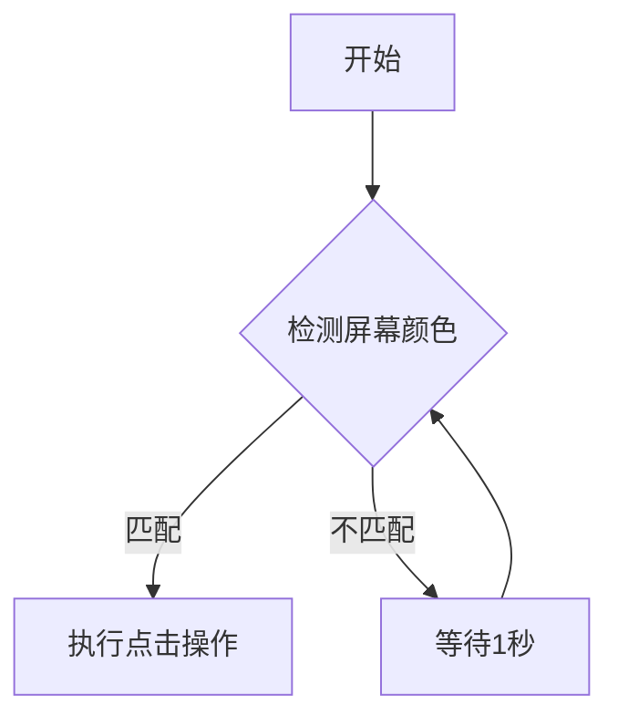

# 高级鼠标点击模拟器 - 全方位使用说明书


## 目录
1. [产品概述](#产品概述)
2. [适用人群](#适用人群)
3. [基础使用指南](#基础使用指南)
4. [高级功能详解](#高级功能详解)
5. [专业应用场景](#专业应用场景)
6. [技术参数](#技术参数)
7. [版本更新记录](#版本更新记录)
8. [常见问题解答](#常见问题解答)
9. [安全与法律声明](#安全与法律声明)

---

## 产品概述
高级鼠标点击模拟器是一款功能强大的自动化工具，可模拟鼠标点击、移动和键盘操作，适用于自动化测试、游戏辅助、办公自动化等多种场景。

**核心功能**：
- 多种点击模式（单次/双击/长按）
- 智能触发器（颜色/图像/定时触发）
- 宏录制与脚本编辑
- 远程控制功能
- 性能监控与日志记录

---

## 适用人群

### 普通用户
- **游戏玩家**：自动点击、连发功能、压枪辅助
- **办公人员**：重复性表格操作、批量文件处理
- **网络营销**：自动化广告点击、社交媒体管理

### 专业用户
- **测试工程师**：UI自动化测试、压力测试
- **开发者**：自动化部署、持续集成
- **数据分析师**：数据采集自动化

### 行业应用
- **制造业**：设备监控界面操作
- **金融业**：报表自动生成
- **医疗**：医疗影像系统批量处理

---

## 基础使用指南

### 安装与启动
1. 下载最新版本程序
2. 双击运行`Mouse_Click_Simulator.exe`
3. 首次运行会自动创建配置文件

### 简单点击设置
```python
# 示例：设置每秒点击一次左键
1. 选择"左键"作为鼠标按键
2. 设置点击间隔为1000ms
3. 点击"开始模拟"按钮
```

### 紧急停止
- 点击界面上的红色"紧急停止"按钮
- 或连续按住ESC键3秒

---

## 高级功能详解

### 宏录制功能
**操作流程**：
1. 点击"开始录制宏"
2. 执行需要录制的鼠标操作
3. 点击"停止录制"
4. 可保存为.json文件供后续使用

**技术实现**：
```python
# 宏动作数据结构示例
{
    "type": "click",
    "button": "left",
    "x": 100,
    "y": 200,
    "time": 0.5  # 距离上一个动作的时间间隔
}
```

### 脚本引擎
支持Python语法，预置变量：
- `mouse`: 鼠标控制器
- `keyboard`: 键盘模块
- `pyautogui`: 自动化控制库

**示例脚本**：
```python
# 自动化登录脚本
mouse.move(100, 150)
mouse.click('left')
keyboard.write('username')
mouse.move(100, 180)
mouse.click('left')
keyboard.write('password')
mouse.move(200, 200)
mouse.click('left')
```

### 远程控制
采用AES-256加密通信，端口可自定义

**协议格式**：
```
[命令类型][分隔符][参数1][分隔符][参数2]
示例：CLICK|left|100|200
```

---

## 专业应用场景

### 游戏开发测试
- **点击精度测试**：通过坐标偏移设置模拟不同点击位置
- **压力测试**：设置高频率点击测试游戏响应能力
- **AI训练**：录制玩家操作宏作为训练数据

### 工业自动化


### 金融行业合规测试
- 测试交易系统在极端操作下的稳定性
- 模拟高频交易操作
- 自动化报表生成验证

---

## 技术参数

### 性能指标
| 项目 | 参数 |
|------|------|
| 最高点击频率 | 1000次/秒 |
| 坐标精度 | ±1像素 |
| 颜色识别精度 | 24位真彩色 |
| 图像识别速度 | <200ms |

### 系统要求
- Windows 7/10/11
- Python 3.8+
- 最低4GB内存
- 支持OpenGL 3.0+

---

## 版本更新记录

### v2.4 (2025-01-15)
- 新增压枪模式算法优化
- 改进远程控制加密协议
- 修复内存泄漏问题

### v2.3 (2024-11-20)
- 增加多显示器支持
- 优化CPU占用率
- 添加脚本调试功能

### v2.2 (2024-09-05)
- 首次加入宏录制功能
- 改进UI布局
- 增强防检测机制

---

## 常见问题解答

**Q：程序会被游戏反作弊系统检测吗？**
A：本程序不修改游戏内存，仅模拟输入设备信号，但某些游戏可能检测自动化操作，请合理使用。

**Q：如何实现更复杂的自动化流程？**
A：建议结合脚本功能，参考示例：
```python
for i in range(10):
    if check_color(100, 200, "#FF0000"):
        mouse.click()
    else:
        keyboard.press('space')
    time.sleep(0.5)
```

**Q：程序占用资源过高怎么办？**
A：尝试以下优化：
1. 降低监控频率
2. 关闭不必要的触发器
3. 减少日志记录级别

---

## 安全与法律声明

### 使用限制
- 禁止用于作弊、攻击等非法用途
- 商业使用需获得授权
- 不得绕过系统安全机制

### 免责条款
作者不对滥用本软件造成的后果负责，使用者应遵守当地法律法规。

### 技术支持
- GitHub Issues: [问题报告](https://github.com/duma520)
- 文档更新: [项目主页](https://github.com/duma520)

---

**版权声明**
© 2025 杜玛 保留所有权利
本文档内容未经书面许可不得转载或用于商业用途
